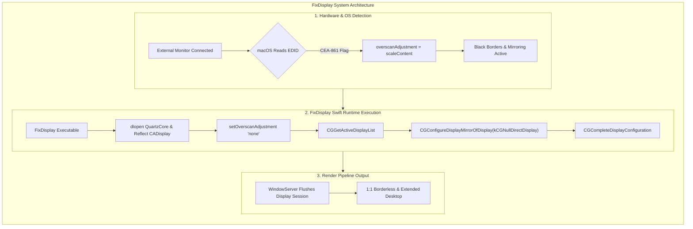

# 🖥️ FixDisplay for macOS

## 📖 Overview

When connecting certain external monitors or TVs via HDMI or DisplayPort adapters, macOS frequently introduces two display degradation issues:

1. 🖼️ **Software Underscan (Black Borders):** macOS misinterprets the monitor's EDID payload as a legacy consumer television and forcibly scales down the desktop framebuffer to ~80–90% of native screen bounds.
2. 🪞 **Display Mirroring:** macOS defaults to mirroring the primary/built-in display instead of creating an independent, extended desktop space.

`FixDisplay` is a lightweight, native Swift menu bar utility that resolves both issues simultaneously. It bypasses `WindowServer` file persistence overrides by invoking private **QuartzCore (`CADisplay`)** properties and committing an atomic **CoreGraphics** display transaction to force true 1:1 pixel rendering and unmirrored extended desktop mode.

## 🔍 Technical Root Cause

When a display connects to macOS, two separate graphics subsystem behaviors trigger this state:

### 📺 1. EDID Misclassification (Underscan)
The display sends an **EDID (Extended Display Identification Data)** payload to macOS. If the payload contains a **CEA-861 Extension Block** flagging it as a consumer electronics display (TV), `WindowServer` assumes the physical bezel will crop image edges. QuartzCore sets `overscanAdjustment` to `"scaleContent"`, shrinking the desktop framebuffer down to a scalar between `0.80` and `0.89` and padding the display border with solid black pixels.

### 🪞 2. Default Mirroring Topology
When detecting hotplugged monitors or waking from sleep, macOS's display manager often defaults to assigning newly attached display IDs as mirror targets of the main display (`CGConfigureDisplayMirrorOfDisplay`). This mirrors screen contents and forces non-native aspect ratios instead of allocating an independent framebuffer session.

## 📊 Technical State & Property Matrix

| Layer / Subsystem | Property / API           | Bugged / Default State | Fixed State            | Description                                                                          |
| :---------------- | :----------------------- | :--------------------- | :--------------------- | :----------------------------------------------------------------------------------- |
| **QuartzCore**    | `overscanAdjustment`     | `"scaleContent"`       | `"none"`               | Dictates whether software scaling padding is applied                                 |
| **QuartzCore**    | `overscanAmount`         | `0.8003` – `0.8974`    | `1.0`                  | Scalar fraction of physical display area utilized                                    |
| **QuartzCore**    | `isOverscanned`          | `true`                 | `false`                | Hardware flag reported by CEA-861 EDID inspection                                    |
| **CoreGraphics**  | Display Mirroring Target | `masterDisplayID`      | `kCGNullDirectDisplay` | Determines whether the display mirrors another screen or acts as an extended desktop |

---

## 🏗️ System Architecture & Workflow

The flowchart below illustrates how `FixDisplay` intercepts QuartzCore properties and forces `WindowServer` to flush framebuffers.



## ⚡ Runtime Execution Sequence

The sequence diagram below shows the runtime interaction between the Swift menu bar app, QuartzCore, CoreGraphics, and `WindowServer`.

```mermaid
sequenceDiagram
    autonumber
    actor User
    participant App as FixDisplay App
    participant QC as QuartzCore (CADisplay)
    participant CG as CoreGraphics Engine
    participant WS as WindowServer
    participant Display as Physical Display

    User->>App: Clicks "Fix Display & Extended Mode" (or auto-launch)
    
    rect rgb(30, 40, 60)
        Note over App,QC: 1. Overscan Fix
        App->>QC: Read NSClassFromString("CADisplay").displays
        QC-->>App: Return list of active CADisplay instances
        loop For each CADisplay instance
            App->>QC: perform("setOverscanAdjustment:", with: "none")
        end
    end

    rect rgb(40, 60, 40)
        Note over App,CG: 2. Unmirror & Atomic Commit
        App->>CG: CGBeginDisplayConfiguration(&config)
        App->>CG: CGGetActiveDisplayList()
        loop For each active display ID
            App->>CG: CGConfigureDisplayMirrorOfDisplay(config, id, kCGNullDirectDisplay)
        end
        App->>CG: CGCompleteDisplayConfiguration(config, .forSession)
    end

    CG->>WS: Push combined overscan + unmirror display update
    WS->>Display: Re-allocate framebuffers & detach mirror stream
    Note over Display: 100% unscaled 1:1 extended desktop display active
```



## 🛠️ Compilation & Installation

### 📦 1. Build Executable

Compile the Swift source file into the `FixDisplay` binary:

```bash
swiftc -O FixDisplayApp.swift -o FixDisplay
```

🔄 ### 2. Auto-Start at Login

#### Option A: 🖥️ System Settings (GUI)

1. Move the compiled binary to a stable folder (e.g., `~/Applications/` or `/usr/local/bin/`).
2. Open **System Settings > General > Login Items & Extensions**.
3. Under **Open at Login**, click the **`+`** button.
4. Select the `FixDisplay` binary and confirm.

---

#### Option B: ⚙️ LaunchAgent (CLI Daemon)

1. Install the binary to `/usr/local/bin/`:

```bash
sudo mkdir -p /usr/local/bin
sudo cp FixDisplay /usr/local/bin/
```

2. Create ~/Library/LaunchAgents/com.user.fixdisplay.plist:

```xml
<?xml version="1.0" encoding="UTF-8"?>
<!DOCTYPE plist PUBLIC "-//Apple//DTD PLIST 1.0//EN" "[http://www.apple.com/DTDs/PropertyList-1.0.dtd](http://www.apple.com/DTDs/PropertyList-1.0.dtd)">
<plist version="1.0">
<dict>
    <key>Label</key>
    <string>com.user.fixdisplay</string>
    <key>ProgramArguments</key>
    <array>
        <string>/usr/local/bin/FixDisplay</string>
    </array>
    <key>RunAtLoad</key>
    <true/>
    <key>KeepAlive</key>
    <false/>
</dict>
</plist>
```

3. Load and activate the service:

```bash
launchctl load ~/Library/LaunchAgents/com.user.fixdisplay.plist
```

## 🧹 Uninstallation & Removal

To completely remove the utility and background daemon:

```bash
# 1. Unload LaunchAgent
launchctl unload ~/Library/LaunchAgents/com.user.fixdisplay.plist 2>/dev/null

# 2. Delete configuration and executable
rm -f ~/Library/LaunchAgents/com.user.fixdisplay.plist
sudo rm -f /usr/local/bin/fixdisplay
```