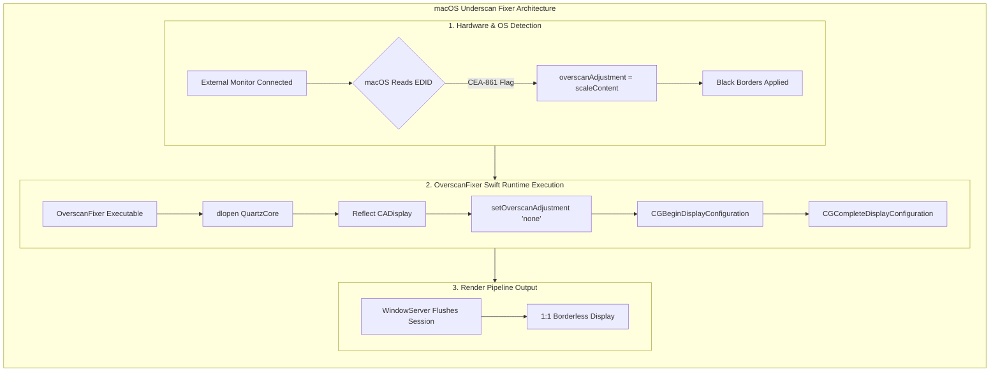
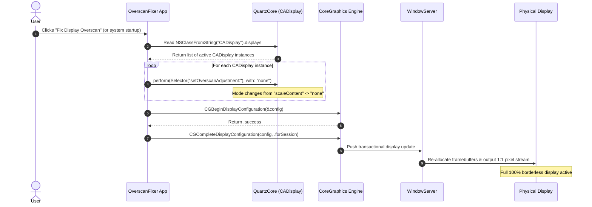

# macOS Underscan Fixer: Technical Documentation

## Overview

On macOS, connecting certain external monitors or TVs via HDMI or DisplayPort adapters can cause dark black borders around the display. This occurs when macOS reads the monitor's EDID broadcast as a "legacy television" and forcibly applies **software underscan** (scaling down the desktop framebuffer to ~80-90%).

This project bypasses `WindowServer` file persistence overrides by invoking private **QuartzCore (`CADisplay`)** properties and committing a real-time **CoreGraphics** display transaction at runtime.

---

## Technical Root Cause

When a display communicates with macOS, it sends an **EDID (Extended Display Identification Data)** payload:

1. **CEA-861 Extension Block**: If flagged as a consumer electronics display (TV), macOS defaults to scaling the framebuffer down.
2. **`overscanAdjustment` Property**: QuartzCore sets `overscanAdjustment` to `"scaleContent"`.
3. **Framebuffer Shrinking**: The desktop surface is scaled down to `0.80 - 0.89`, surrounding the picture with black padding.

### Property Matrix

| Property                 | Default (Bugged State) | Fixed State | Description                                |
| :----------------------- | :--------------------- | :---------- | :----------------------------------------- |
| **`overscanAmount`**     | `0.8003` – `0.8974`    | `1.0`       | Scalar fraction of physical screen used    |
| **`overscanAdjustment`** | `"scaleContent"`       | `"none"`    | QuartzCore mode dictating hardware scaling |
| **`isOverscanned`**      | `true`                 | `false`     | EDID broadcast hardware state              |

## System Architecture & Workflow

The flowchart below illustrates how `OverscanFixer` intercepts QuartzCore properties and forces `WindowServer` to flush framebuffers.



## Runtime Execution Sequence

The sequence diagram below shows the runtime interaction between the Swift menu bar app, QuartzCore, CoreGraphics, and `WindowServer`.



## Compilation & Installation

### 1. Build Executable

Compile the Swift source file using `swiftc`:

```bash
swiftc -O OverscanFixerApp.swift -o OverscanFixer
```

### 2. Auto-Start at Login

#### Option A: System Settings (GUI)

1. Move the compiled binary to a stable folder (e.g., `~/Applications/` or `/usr/local/bin/`).
2. Open **System Settings > General > Login Items & Extensions**.
3. Under **Open at Login**, click the **`+`** button.
4. Select the `OverscanFixer` binary and confirm.

---

#### Option B: LaunchAgent (CLI Daemon)

1. Install the binary to `/usr/local/bin/`:

```bash
sudo mkdir -p /usr/local/bin
sudo cp OverscanFixer /usr/local/bin/
```

2. Create ~/Library/LaunchAgents/com.user.overscanfixer.plist:

```xml
<?xml version="1.0" encoding="UTF-8"?>
<!DOCTYPE plist PUBLIC "-//Apple//DTD PLIST 1.0//EN" "[http://www.apple.com/DTDs/PropertyList-1.0.dtd](http://www.apple.com/DTDs/PropertyList-1.0.dtd)">
<plist version="1.0">
<dict>
    <key>Label</key>
    <string>com.user.overscanfixer</string>
    <key>ProgramArguments</key>
    <array>
        <string>/usr/local/bin/OverscanFixer</string>
    </array>
    <key>RunAtLoad</key>
    <true/>
    <key>KeepAlive</key>
    <false/>
</dict>
</plist>
```

3. Load and activate the service:

```bash
launchctl load ~/Library/LaunchAgents/com.user.overscanfixer.plist
```

## Uninstallation & Removal

To completely remove the utility and background daemon:

```bash
# 1. Unload LaunchAgent
launchctl unload ~/Library/LaunchAgents/com.user.overscanfixer.plist 2>/dev/null

# 2. Delete configuration and executable
rm -f ~/Library/LaunchAgents/com.user.overscanfixer.plist
sudo rm -f /usr/local/bin/OverscanFixer
```